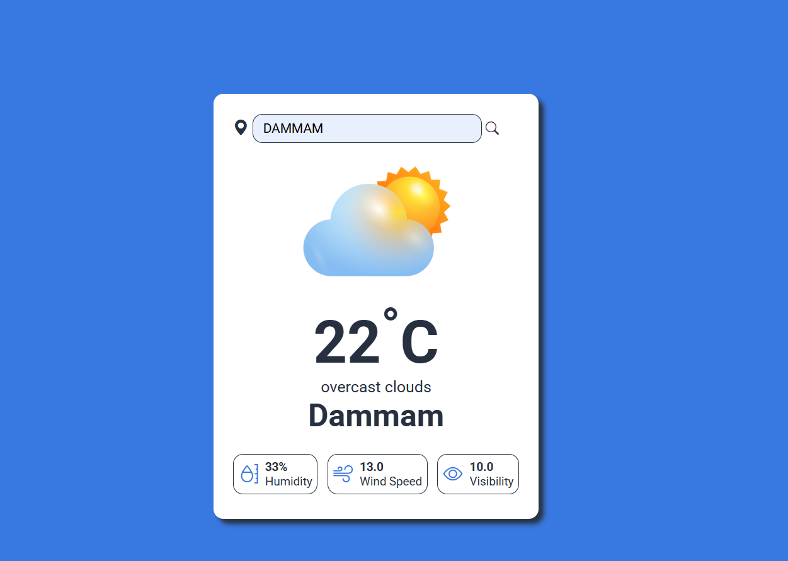

# Weather App

A simple weather app built with HTML, CSS, and JavaScript. It fetches real-time weather data using the OpenWeatherMap API and displays the temperature, humidity, wind speed, and visibility for a given city.

## Features

- Search for weather by city name.
- Dynamic weather icons based on conditions (e.g., rain, clear, clouds).
- Responsive design.

## Technologies Used

- HTML
- CSS
- JavaScript
- OpenWeatherMap API

## How to Run Locally

1. Clone this repository: `git clone https://github.com/MajidShwkah/Weather-App.git`
2. Open `index.html` in your browser.

## Live Demo

[Link to live demo if available]

## Screenshots

